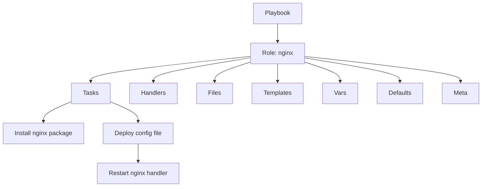

# 📘 Ansible Roles 

This repository explains **Ansible Roles** in simple terms with examples and best practices.
It is designed for anyone starting with Ansible who wants to understand **why roles matter**, how they are structured, and how to use them in real-world automation.

---

## 🔹 What is an Ansible Role?

An **Ansible Role** is a **reusable, self-contained unit of automation**.
It organizes **tasks, variables, files, templates, and handlers** into a **structured format**.

👉 Think of it as a **“building block”** for automation:

* Instead of writing one big playbook with all tasks,
* You split it into smaller, reusable roles (e.g., one role for **nginx**, one for **postgres**, one for **users**).

This approach makes automation **modular, maintainable, reusable, and consistent** across projects.

---

## 🔹 Why Use Roles?

* **🧩 Modularity** → Break complex playbooks into smaller, logical parts
* **♻️ Reusability** → Use the same role across multiple playbooks/projects
* **🛠️ Maintainability** → Easy to update in one place, apply everywhere
* **📖 Readability** → Cleaner playbooks (abstracts details into roles)
* **🤝 Collaboration** → Teams can work on separate roles independently
* **✅ Consistency** → Apply the same configuration uniformly across environments

---

## 🔹 Key Components of a Role

Each role has several optional components:

* **Tasks** → The main list of actions the role performs
* **Handlers** → Triggered when a task changes something (e.g., restart nginx)
* **Files** → Static files to copy to managed hosts
* **Templates** → Dynamic files using **Jinja2** templating
* **Vars** → Variables defined for the role
* **Defaults** → Default variables (can be overridden later)
* **Meta** → Metadata about the role (dependencies, author, etc.)
* **Library** → Custom modules/plugins if needed
* **Module\_defaults** → Default module parameters
* **Lookup\_plugins** → Custom lookup plugins

---

## 🔹 Role Directory Structure

Ansible enforces a **standard structure** for roles.

```
<role_name>/
  ├── defaults/
  │   └── main.yml        # Default variables (lowest priority)
  ├── files/              # Static files
  ├── handlers/
  │   └── main.yml        # Handlers (e.g., restart service)
  ├── meta/
  │   └── main.yml        # Metadata (dependencies, author info)
  ├── tasks/
  │   └── main.yml        # Main list of tasks to execute
  ├── templates/          # Jinja2 templates
  ├── vars/
      └── main.yml        # Variables (higher priority than defaults)
```

📌 Not all folders are required — only use what you need.

---

## 🔹 Example Role Usage

Imagine you create a role called **nginx** to install and configure the web server.

**Playbook Example:**

```yaml
- hosts: webservers
  become: yes
  roles:
    - nginx
```

When you run this, Ansible will automatically look for the role’s **tasks/main.yml** and execute it.

---

## 🔹 Example – Tasks in a Role

**roles/nginx/tasks/main.yml**

```yaml
---
- name: Install nginx
  apt:
    name: nginx
    state: present

- name: Deploy nginx config
  template:
    src: nginx.conf.j2
    dest: /etc/nginx/nginx.conf
  notify: Restart nginx
```

**roles/nginx/handlers/main.yml**

```yaml
---
- name: Restart nginx
  service:
    name: nginx
    state: restarted
```

👉 With this setup:

* If the config file changes, the handler will restart nginx.
* If nothing changes, nginx won’t restart unnecessarily (**idempotency**).

---

## 🔹 Visual Overview – Roles in Action

Here’s how **Playbooks, Roles, Tasks, and Handlers** fit together:



📌 This diagram shows that a **Playbook calls a Role**, which organizes everything into tasks, handlers, variables, and templates.

---

## 🔹 Best Practices for Roles

✅ Use roles for **any reusable logic** (e.g., DB setup, web server, monitoring agents)
✅ Keep roles **single-purpose** (don’t mix unrelated tasks)
✅ Use **defaults** for safe variable values
✅ Store sensitive data in **Ansible Vault**
✅ Publish reusable roles on **Ansible Galaxy** for others to use

---

## ✅ Summary

* **Ansible Roles** help you organize automation into **reusable, structured units**
* They contain **tasks, handlers, files, templates, vars, and defaults**
* Roles make automation **modular, consistent, and easy to maintain**
* They follow a **standard directory structure** recognized by Ansible
* Used correctly, roles save time and make collaboration easier

---

## 🚀 Next Steps

Once you understand roles, you should explore:

1. **Ansible Galaxy**

   * A public hub where you can share and download roles
   * Command:

     ```bash
     ansible-galaxy init myrole   # Create a new role
     ansible-galaxy install <role_name>
     ```

2. **Variables & Defaults in Roles**

   * Learn how to override defaults for flexibility

3. **Role Dependencies (meta/main.yml)**

   * Define which roles depend on others (e.g., DB before app)

4. **Molecule Testing**

   * A framework for testing Ansible roles

📌 By mastering roles, you move from **basic playbooks** → **scalable, production-ready automation**.

---
